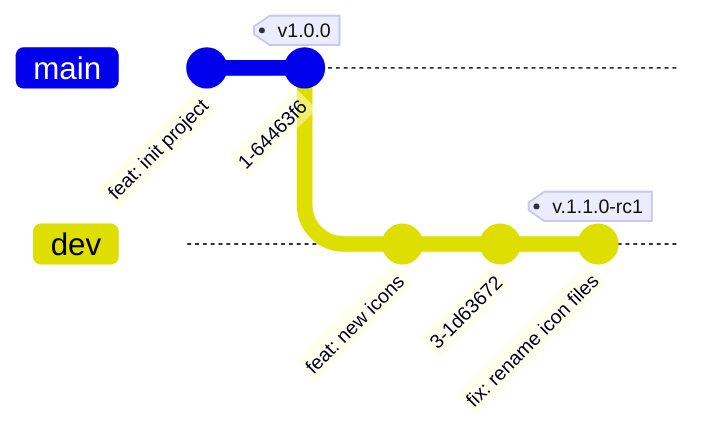

# GitGraph Diagram Syntax

## 1. Left-Right Simple GitGraph

```mermaid
---
title: Example Left-Right Git diagram
---
gitGraph
    commit
    commit
    branch dev
    checkout dev
    commit
    commit
    commit
```

## 2. Top-Bottom Simple GitGraph

```mermaid
---
title: Example Top-Bottom Git diagram
---
gitGraph TB:
    commit
    commit
    branch dev
    checkout dev
    commit
    commit
    commit
```

## 3. Commit id and tag

```mermaid
gitGraph
    commit id: "feat: init project"
    commit tag: "v1.0.0"
    branch dev
    checkout dev
    commit id: "feat: new icons"
    commit
    commit id: "fix: rename icon files" tag: "v.1.1.0-rc1"
```