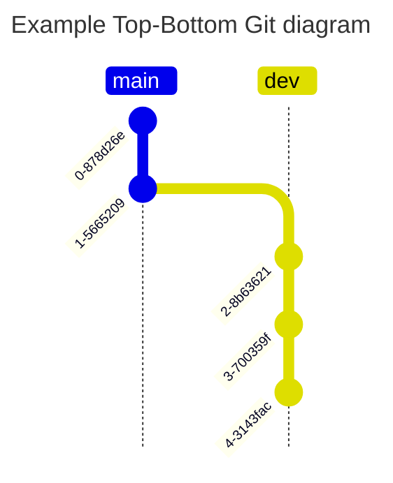
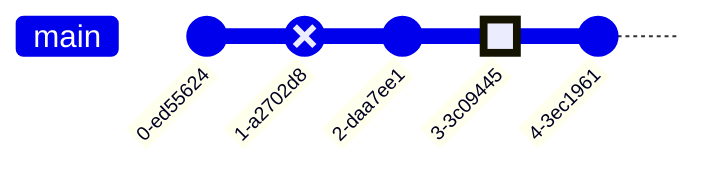
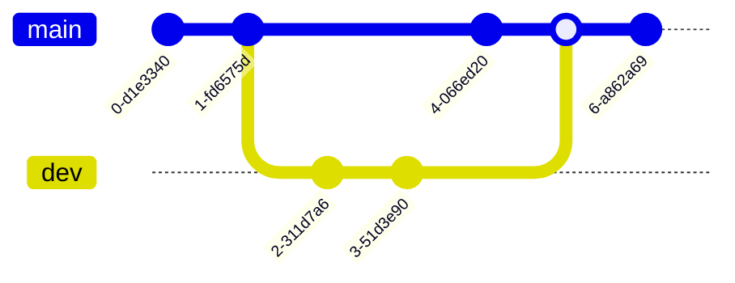

# GitGraph Diagram Syntax

## 1. Left-Right Simple GitGraph

## 2. Top-Bottom Simple GitGraph

## 3. Commit id and tag

## 4. Commit Type

## 5. Merging Branch

## 6. Cherry-pick commit

## 7. Themes and custom main branch

