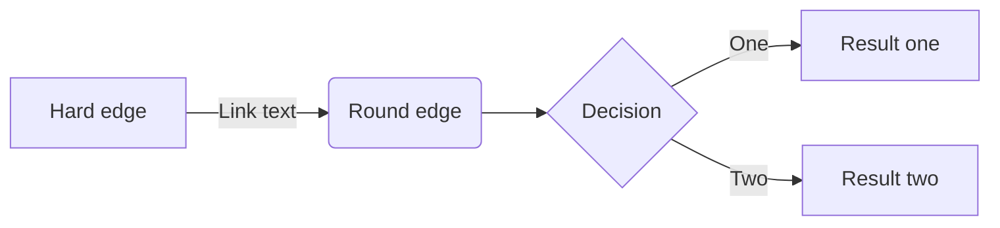
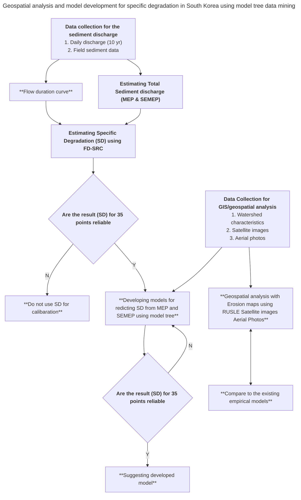
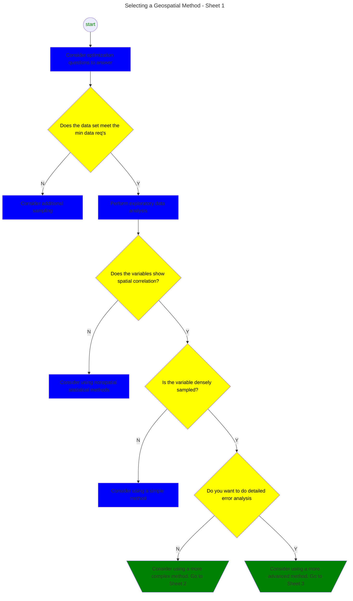

# FlowChart Diagram Syntax

## 1. Left-Right Simple FlowChart

## 2. Top-Down Simple FlowChart

Chart inspiration source:
- [Geospatial analysis and model development for specific degradation in South Korea using model tree data mining](https://www.sciencedirect.com/science/article/pii/S0341816221000011)
- [Source full resolution chart image](https://ars.els-cdn.com/content/image/1-s2.0-S0341816221000011-gr4.jpg)

## 3. FlowChart with Styling

Chart inspiration source:
- [Flow Charts for Choosing Geospatial Methods](https://gro-1.itrcweb.org/flow-charts-for-choosing-geospatial-methods/)
- [Source full resolution chart image](https://gro-1.itrcweb.org/wp-content/uploads/2016/10/gro_flow_chart_1of4_10_26_16.png)
