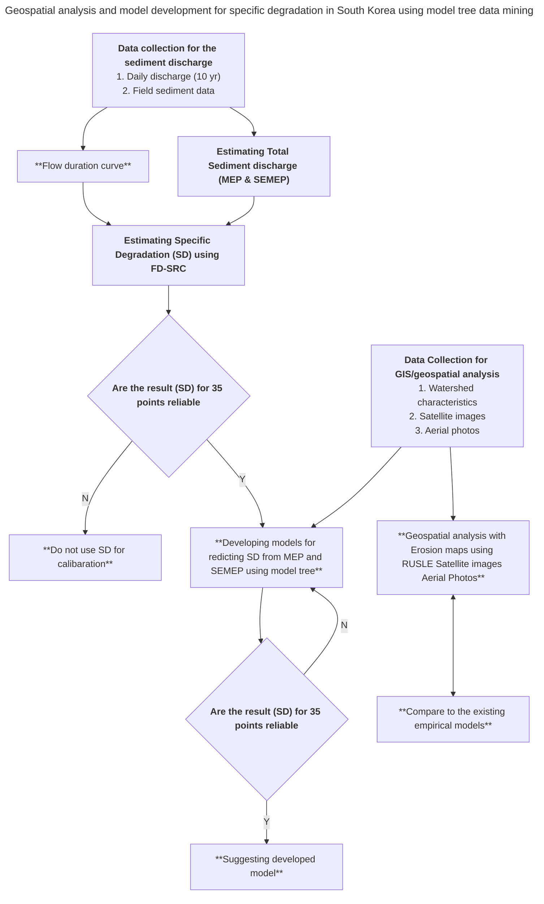

# FlowChart Diagram Syntax

Chart inspiration source:
- [Geospatial analysis and model development for specific degradation in South Korea using model tree data mining](https://www.sciencedirect.com/science/article/pii/S0341816221000011)
- [Source full resolution chart image](https://ars.els-cdn.com/content/image/1-s2.0-S0341816221000011-gr4.jpg)